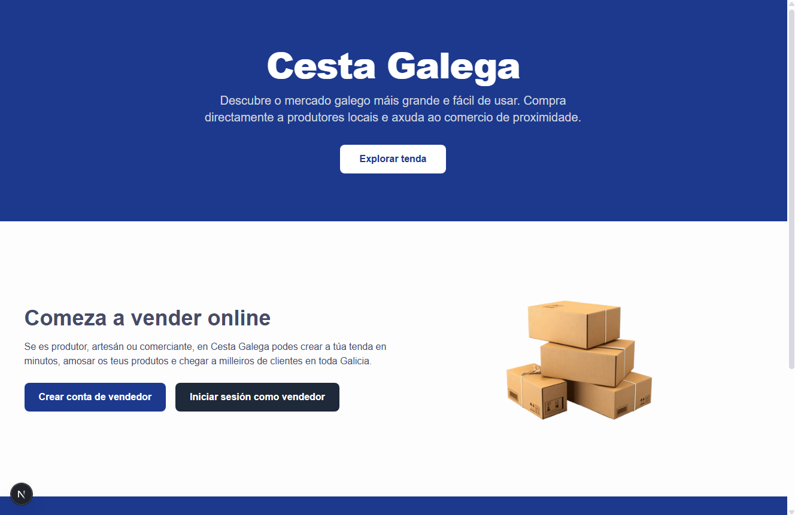
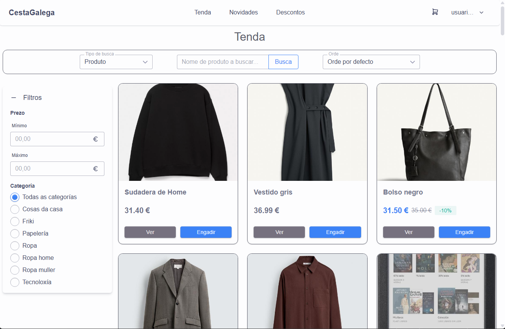
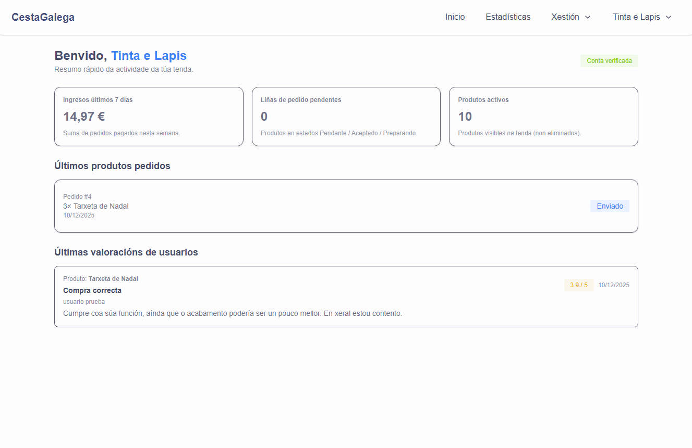

# CestaGalega

## Descripción

CestaGalega es una aplicación web que actúa como un mercado digital pensado para Galicia. Su objetivo es conectar a pequeños comercios y emprendedores locales con personas que buscan productos de la zona, ofreciendo una plataforma sencilla donde las tiendas puedan mostrar y vender sus artículos sin necesidad de tener su propia página web.

El proyecto pretende fomentar el comercio local y crear una alternativa accesible y cercana frente a las grandes plataformas de venta online, facilitando tanto la visibilidad de los negocios gallegos como la compra de productos por parte de los usuarios.

## Instalación / Puesta en marcha

**Requisitos**:
- Node.js 20.9 o superior
- npm 9 o superior
- Docker
- Cuenta de Cloudinary (plan gratuito)

**Pasos:**
1. Clonar el repositorio y acceder al directorio `cesta-galega/`
2. Instalar las dependencias con `npm install`
3. Renombrar el fichero `.env.example` a `.env` y si es necesario cambiar las propiedades establecidas por defecto
4. Crear una cuenta en cloudinary.com, web que gestiona las imágenes de la aplicación
5. Obtener ```Cloud name``` y establecerlo en el fichero ``.env``
6. Levantar el contenedor Docker con el comando `docker compose up -d`
7. Crear la base de datos con el comando `npx prisma migrate deploy` 
8. Regenerar el cliente prisma `npx prisma generate`
9. Levantar la página web con el comando `npm run dev`
10. Abrir en el navegador la dirección `localhost:3000`

## Uso

Al entrar en la web llegamos a la _landing page_ una página que resume brevemente el proyecto y redirige a los usuarios.

Dependiendo del tipo de usuario que seamos (comprador o vendedor) deberemos hacer acciones distintas. Los usuarios pueden
ir la tienda directamente en el botón de ``Explorar tenda`` mientras que las empresas pueden ir a iniciar sesión o crear
una cuenta directamente.

La interfaz web está pensada y adaptada para que sea sencilla de usar para cualquier persona en cualquier tipo de dispositivo,
se adapta a grandes pantallas y a móviles. Se utilizaron estándares de diseño para facilitar al usuario una simple navegación.

Vamos a ver el uso de una manera simple dependiendo del rol.



### Usuario

Como usuario anónimo la primera vez que entramos en la web podemos ver la tienda. En la tienda veremos: barra de búsqueda y orden, filtros
y listado de productos. En la cabecera de la web veremos un botón de ``Iniciar sesión`` que nos permitirá iniciar sesión o
crear una cuenta nueva de usuario. Los usuarios anónimos (sin cuenta) no tienen todas las características disponibles.

Cómo usuario anónimo podremos navegar por la tienda y ver diferentes productos. Veremos que cada producto tiene dos botones,
el botón de ver nos llevará a ese producto específico y el de añadir estará bloqueado, este botón se desbloquea una vez esté la sesión
iniciada.

Las funcionalidades principales que podemos hacer como usuario ya registrado son varias: filtrar y navegar la tienda, buscar productos y empresas,
hacer pedidos directos desde un producto o añadir al carrito y hacer una compra de varios productos, ver historial de pedidos,
cambiar información personal en ajustes, valorar productos comprados...



### Empresa

Para acceder al apartado de empresa debemos tener una cuenta en la aplicación, para esto desde la página de inicio (_landing page_)
debemos o crear una cuenta o iniciar sesión con una cuenta ya creada. En caso de haber usado la aplicación anteriormente y tener
un token válido almacenado en las cookies de la web, te llevará directamente sin tener que volver a iniciar sesión.

Lo primero que vemos será lo que se conoce como una _dashboard_, este apartado es un breve resumen sobre el estado y actividad
de nuestra tienda online, aquí podemos ver alguna estadística, últimos pedidos y últimas valoraciones.

En la parte superior encontramos una barra de navegación que nos permite movernos a los diferentes apartados. En ``Estadísticas``
podremos ver gráficos sobre datos de nuestra tienda (productos más vendidos, dinero generado por fechas...). En el apartado de gestión
podemos manejar los datos de nuestros productos (añadir, editar, eliminar, ver previsualización) y también tenemos otro apartado
de pedidos que nos permite actualizar el estado de estos para que el usuario vea el estado de ese producto en su pedido.

Por último tenemos un menú desplegable que es sobre la información de nuestra empresa, aquí podremos ver nuestra tienda,
como la vería un usuario y podemos navegar por nuestros productos. También podemos ir a ajustes y actualizar la información de
la empresa (nombre, descripción, logo...). Por último tenemos un botón de cerrar sesión que nos eliminará las cookies de sesión
almacenadas en nuestro navegador.



## Sobre el autor

Soy Rodrigo Iglesias Nieto, soy de Santiago de Compostela y tengo 21 años. Desde pequeño me ha gustado la informática y 
hace unos años decidí estudiar programación, realicé el ciclo de DAM en el IES Antón Losada Diéguez de A Estrada y al terminar
decidí seguir estudiando y ahora estoy realizando DAW a distancia.

Lo que destaco de mí es la curiosidad y la autonomía para aprender sobre nuevas tecnologías, lenguajes, etc. Por mis estudios previos
las tecnologías que más domino son: Java, SQL, Javascript y otras que conozco pero no manejo tanto son: Docker, React, Angular.

Decidí hacer este proyecto porque me sirve para formarme en tecnologías como React o las API REST de una manera más profunda y descubrir nuevas
herramientas como Prisma ORM o Supabase que me permitirán seguir desarrollando proyectos webs en un futuro.

La manera más sencilla de contactarme ahora o en un futuro es a través de correo electrónico: ``iglnierod@gmail.com``

## Licencia

El proyecto se distribuye bajo la licencia MIT License, cuyo texto completo se incluye en el fichero [LICENSE](LICENSE) del
repositorio y puede consultarse también en [https://opensource.org/licenses/MIT](https://opensource.org/licenses/MIT).

Esta licencia de software libre permite usar, copiar, modificar y distribuir el código, así como crear obras derivadas, siempre
que se mantenga el aviso de copyright y la nota de licencia original, y sin ofrecer ningún tipo de garantía por parte del
autor.

## Documentación

Cesta Galega es una web creada con el framework Next.js que trabaja con la tecnología React y pertenece a Vercel. Propone
una solución a la falta de comercio online de pequeñas empresas gallegas y facilita a los usuarios la compra de producto
local.

Es una aplicación simple que sirve tanto para usuarios como para empresas, el servicio se encarga de gestionar una tienda online
que agrupa productos de todo tipo y de todas las empresas. Permite a los usuarios navegar, realizar pedidos y valorar productos y a la vez
facilita a las empresas la gestión de productos, pedidos, estadísticas y ofrece una tienda personal.

En este proyecto, se ha optado por Next.js por su facilidad de uso y porque permite crear aplicaciones rápidas, escalables y
con buena experiencia de usuario. De esta manera se puede optimizar tanto el desarrollo del lado cliente como el servidor,
lo que es ideal para la gestión de productos y procesos de compra.

Este proyecto dispone de [una documentación más extensa](doc/doc.md) del proyecto que recomiendo revisar.

### Carpetas
Este apartado explica las diferentes carpetas y estructuras del repositorio

- **.github/**: contiene el workflow de github que hace la migración de la base de datos automáticamente.
- **.vscode/**: contiene ajustes y extensiones recomendadas para Visual Studio Code.
- **cesta-galega/**: contiene el proyecto de _Next.js_ y todo el código de la app.
- **doc/**: agrupa los contenidos de la documentación avanzada del repositorio.
- **.gitattributes**: fichero de Git que impide que se guarden cambios de ficheros binarios y que dan problemas.
- **.gitignore**: fichero de Git que impide que se suban y guarden cambios de ficheros privados o innecesarios.
- **LICENSE**: contenido de la licencia del proyecto.

### Explicación sobre carpetas del proyecto Next.js
Aquí se explican en profundidad las carpetas y ficheros principales del proyecto:

- **app/**: contiene todo el código fuente de la app
  - **(pages)/**: agrupa las distintas páginas navegables de la aplicación.
  - **api/**: contiene las diferentes rutas y ficheros de la API REST de la aplicación.
  - **components/**: agrupa todos los componentes usados en la aplicación.
  - **context/**: crea el contexto de alertas para la aplicación.
  - **generated/**: carpeta generada por Prisma ORM, contiene el cliente utilizado para hacer las llamadas a la base de datos.
  - **lib/**: contiene diferentes utilidades de la app. Como auth.js que maneja la autenticación de usuarios en la app o los diferentes
  tipados de datos de objetos
  - **globals.css**: fichero de CSS global del proyecto, se usa para configurar Tailwind y FlyonUI
  - **layout.tsx**: los ficheros `layout.tsx` en _Next.js_ definen la estructura del endpoint de la carpeta en la que se encuentran,
  en este caso es el layout principal que se usa para renderizar la app.
  - **page.tsx**: los ficheros `page.tsx` en _Next.js_ renderizan el contenido de la página.
- **prisma/**: contiene lo necesario para Prisma ORM.
  - **migrations/**: contiene las migraciones y cambios que sufre la base de datos.
  - **schema.prisma**: fichero que define la estructura de la base de datos SQL.
- **public/**: contiene los recursos estáticos usados en la web.
- **sql/**: contiene scripts sql que insertan datos de prueba en la base de datos.
- **.env.example**: fichero de variables de entorno de ejemplo para poder definirlas fácilmente.
- **.prettierrc**: fichero de configuración de la extensión Prettier, formatea el proyecto.
- **docker-compose.yml**: fichero docker compose que levanta un contenedor con PostgreSQL para desarrollar la app.
- **eslint.config.mjs**: configuración de la dependencia ESLint que muestra fallos de TypeScript.
- **next.config.ts**: fichero de configuración de _Next.js_.
- **package.json**: fichero que define las dependencias del proyecto.
- **postcss.config.mjs**: fichero de configuración de la dependencia PostCSS (necesaria para Tailwind).
- **tailwind.config.ts**: fichero de configuración de la dependencia Tailwind
- **tsconfig.json**: fichero de configuración de TypeScript.

## Guía de contribución

Los commits de este proyecto seguirán el formato de [Conventional Commits](https://www.conventionalcommits.org/en/v1.0.0/), usando los siguientes tipos de commit:

```
<type>[optional scope]: <description>

[optional body]

[optional footer(s)]
```

| Tipo         | Cuándo usarlo                                               | Ejemplo                                       |
|--------------|-------------------------------------------------------------|-----------------------------------------------|
| **feat**     | Nueva funcionalidad                                         | `feat(home): añade sección de noticias`       |
| **fix**      | Corrección de error                                         | `fix(api): corrige URL incorrecta en fetch`   |
| **chore**    | Cambios menores o tareas que no afectan el código funcional | `chore: actualiza .gitignore`                 |
| **docs**     | Cambios en documentación                                    | `docs: actualiza README`                      |
| **style**    | Cambios de formato o estilo (sin cambiar lógica)            | `style: formatea código con Prettier`         |
| **refactor** | Reescritura de código sin cambiar comportamiento            | `refactor: simplifica componente Header`      |
| **test**     | Añadir o modificar tests                                    | `test: añade tests para el componente Footer` |
| **build**    | Cambios en dependencias o build                             | `build: actualiza versión de Next.js`         |
| **ci**       | Cambios en configuración de CI/CD                           | `ci: actualiza workflow de GitHub Actions`    |

### Cómo hacer nuevas implementaciones

Lo primero es revisar en este mismo fichero la estructura de carpetas y archivos del proyecto, para localizar correctamente lo
que debemos modificar.

En la carpeta [lib](cesta-galega/app/lib) se encuentra la mayor parte de la lógica de la aplicación, en esta carpeta existen subcarpetas
nombradas por el tipo de dato que manejan. Siempre encontraremos tres ficheros diferentes: ``<dato>.schema.ts``, ``<dato>.repo.ts``, ``<dato>.mapper.ts``:
- Fichero schema: define los tipos de datos utilizados en la app.
- Fichero repo: contiene funciones de Prisma para hacer llamadas a la base de datos, únicamente hace llamadas a la tabla del dato que maneja.
- Fichero mapper: contiene funciones que mappean datos sin tipado y lo convierte a un tipo de dato creado previamente en el fichero ``schema``.

Para crear nuevos endpoints se debe hacer siempre en la ruta [/app/api](cesta-galega/app/api).

Para crear una nueva página se debe crear el ``page.tsx`` en la nueva ruta y siempre dentro de la carpeta [/app/(pages)](cesta-galega/app/(pages)).
Si esta página llama a un componente este se debe crear en la carpeta [/app/components](cesta-galega/app/components).
