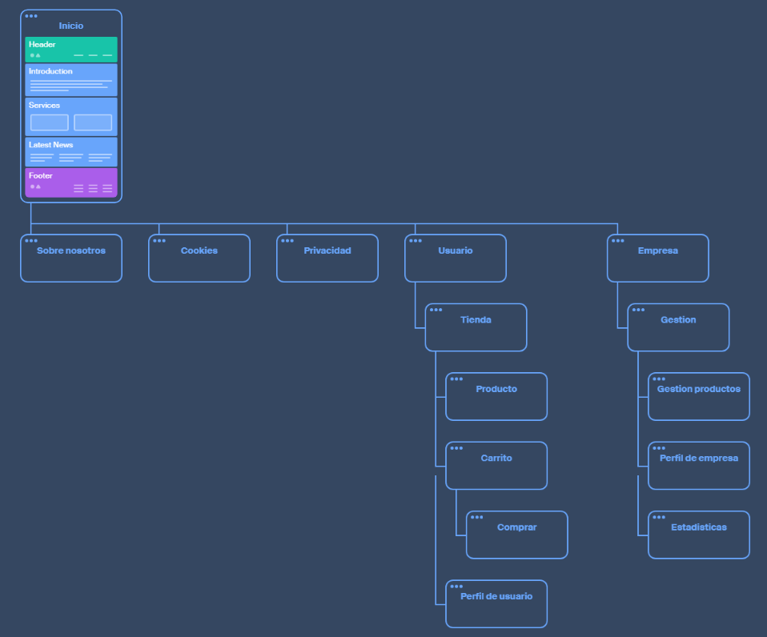

# CestaGalega

- [Introducción](#introducción)
- [Estado de arte o análisis del contexto](#estado-de-arte-o-análisis-del-contexto)
- [Propósito](#propósito)
- [Objetivos](#objetivos)
- [Alcance](#alcance)
    - [Funciones por roles](#funciones-por-roles)
        - [Usuario anónimo:](#usuario-anónimo)
        - [Usuario:](#usuario)
        - [Empresa:](#empresa)
- [Planificación temporal y de recursos de las distintas fases](#planificación-temporal-y-de-recursos-de-las-distintas-fases)
    - [Identificación de fases](#identificación-de-fases)
    - [Diagrama de Gantt](#diagrama-de-gantt)
    - [Identificación de recursos](#identificación-de-recursos)
        - [Recursos personales](#recursos-personales)
        - [Recursos materiales](#recursos-materiales)
            - [Hardware necesario](#hardware-necesario)
            - [Software utilizado](#software-utilizado)
- [Diseño de la solución](#diseño-de-la-solución)
    - [Framework seleccionado: Next.js](#framework-seleccionado-nextjs)
    - [Base de datos](#base-de-datos)
    - [Esquema Entidad-Relación](#esquema-entidad-relación)
    - [Diagrama de navegación](#diagrama-de-navegación)
    - [Software e paquetes de software](#software-e-paquetes-de-software)
    - [Infraestructura de hardware](#infraestructura-de-hardware)
        - [Estaciones de trabajo](#estaciones-de-trabajo)
        - [Seguridad](#seguridad)
            - [Seguridad interna: lógica y accesos](#seguridad-interna-lógica-y-accesos)
            - [Copias de seguridad](#copias-de-seguridad)
- [Presupuesto de la solución](#presupuesto-de-la-solución)
    - [Recursos humanos](#recursos-humanos)
    - [Gastos estimados](#gastos-estimados)
        - [Trabajadores](#trabajadores)
        - [Software y hardware](#software-y-hardware)
    - [Normativa](#normativa)
        - [Protección de datos](#protección-de-datos)
        - [Obligaciones fiscales y laborales](#obligaciones-fiscales-y-laborales)
        - [Prevención de riesgos laborales](#prevención-de-riesgos-laborales)
        - [Ayudas y subvenciones](#ayudas-y-subvenciones)
- [Entregas](#entregas)
    - [Prototipo 1:](#prototipo-1)
- [Propuesta de mejoras](#propuesta-de-mejoras)
- [Conclusiones](#conclusiones)
- [Referencias, Fuentes consultadas y Recursos externos: Webgrafía](#referencias-fuentes-consultadas-y-recursos-externos-webgrafía)
- [Webgrafía](#webgrafía)

## Introducción

CestaGalega es una aplicación web de tipo marketplace orientada a Galicia, el objetivo de este proyecto es conectar a
usuarios con empresas y emprendedores gallegos que deseen vender sus productos en línea.

La plataforma permitirá a tiendas locales registrarse como empresas, crear un perfil propio y gestionar un catálogo de
productos. Por otro lado, los usuarios podrán navegar por el mercado, añadir productos al carrito, realizar pedidos,
consultar historial de compras y dejar valoraciones sobre los artículos.

CestaGalega analizará los datos de los productos mejores valorados, más vendidos, descuentos, novedades. Y ofrecerá al
usuario distintas recomendaciones basadas en sus compras y su historial de búsqueda en la web.

A nivel funcional, el proyecto busca reproducir las características básicas de un comercio electrónico moderno (Amazon,
Aliexpress), pero adaptado a un ámbito local y específico, ofreciendo una solución sencilla y accesible para que
pequeñas empresas gallegas puedan tener visibilidad digital y facilitar las compras a usuarios interesados en apoyar el
comercio local.

## Estado de arte o análisis del contexto

La aplicación está pensanda para dos tipos de usuarios: empresas que quieren disponer de un espacio digital donde
mostrar y vender sus productos sin tener que invertir en su propia tienda online, y usuarios particulares que buscan
productos locales y quieren apoyar al comercio.

Actualmente muchas pequeñas empresas gellegas no tienen una presencia digital, lo que dificulta llegar a nuevos clientes
y competir con grandes tiendas online globales. Por otra parte, los compradores tienen que recurrir a páginas pequeñas o
tiendas físicas para poder comprar estos productos.

La web cubre estas necesidades creando un espacio centralizado donde los usuarios pueden encontrar distintos productos
de empresas gallegas. También creando una herramienta accesible para los emprendedores puedan dar visibilidad y
gestionar fácilmente sus ventas online.

Existen plataformas globales como Amazon o Aliexpress que ofrecen un gran catálogo de productos pero sin ninguna
diferenciación ni foco en el producto local. Estas plataformas consiguen resolver la necesidad de comprar cómodamente
desde casa, pero no promueven ni valoran el comercio de proximidad. Por lo tanto, existe la posibilidad de una solución
regional y escalable, adaptada a la realidad gallega, pero con funcionalidades profesionales.

Hay diferentes maneras de monetizar un negocio así:

- Comisión por venta: la plataforma se lleva un pequeño porcentaje de cada transacción.
- Suscripciones a empresas: permitir a los vendedores tener un plan básico gratuito y planes de pago con más
  visibilidad, estadísticas avanzadas o mejor posicionamiento.
- Publicidad: promoción de productos destacados o campañas especiales dentro de la web.

El proyecto adopta la forma de monetización de **comisión por venta** porque permite al negocio obtener ingresos de manera
proporcional al éxito de las ventas realizadas a través de la plataforma. Esta opción es flexible y no require que los
vendedores se comprometan a pagar una tarifa fija o mensual, lo cual puede ser un obstáculo para las pequeñas empresas.
Además, al basarse en rendimiento, incentiva a la plataforma a mantener su calidad y promover las ventas, beneficiando
tanto a los vendedores como a la propia plataforma.

En este modelo la **comisión será del 10% de cada venta**, lo que proporciona un equilibrio justo entre las ganancias
de la plataforma y las de los vendedores.

## Propósito

El propósito de CestaGalega es ofrecer una plataforma digital que impulse el comercio local con la creación de un
espacio común donde empresas y usuarios interactúan de forma directa. El proyecto busca facilitar la digitalización de
negocios gallegos.

Lo principal es conectar la oferta local con la demanda digital, creando una experiencia de compra online que beneficie
tanto a los vendedores como a los consumidores.

## Objetivos

- Registrar e iniciar sesión de forma básica.
- Navegar por el catálogo de productos publicados.
- Visualizar la información de cada producto.
- Valorar artículos (nota de 1 a 5 y comentario).
- Añadir artículos al carrito.
- Gestionar el carrito de compra.
- Simular el pago mediante un formulario.
- Consultar el historial de pedidos realizados.
- Registrar e iniciar sesión como empresa.
- Crear y gestionar artículos a la venta.
- Visualizar estadísticas básicas de venta.
- Mostrar una página pública con el perfil y todos los productos.
- Aplicar filtros y orden en las vistas de productos.
- Establecer descuentos en productos.

## Alcance

El desarollo se centrará en la creación de un prototipo funcional que refleje las principales características de un
mercado online local, sin llegar a construir una versión de producción. El objetivo es disponer de una app plenamente
navegable, con las funciones básicas necesarias para demostrar el funcionamiento del sistema y su viabilidad.

El sistema incluirá dos tipos de perfiles: usuarios y empresas.
Los usuarios podrán registrarse, explorar productos, añadirlos al carrito, realizar pedidos simulados y dejar
valoraciones.
Las empresas podrán crear y administrar sus productos, consultar estadísticas básicsa de sus ventas y disponer de una
página pública con su catálogo.

No se implementarán funcionalidades avanzadas como sistemas de pagos reales, recuperación de contraseñas mediante correo
electrónico o gestión detallada de stock. El control de inventario se limitará a indicar si un producto está disponible
o no.

El alcance se restringe al entorno académico, por lo que los datos utilizados serán de prueba y no se contemplará el
despliegue en entornos comerciales ni la integración con plataformas externas.

Futuras ampliaciones podrían incluir: la gestión avanzada de stock, sistema de recomendaciones más sofisticado y un
panel de administración global, pero estos aspectos quedan fuera del alcance del desarrollo.

### Funciones por roles

#### Usuario anónimo:

- Navegar por el catálogo de productos
- Buscar y filtrar productos/empresas
- Visualizar los detalles de productos
- Registrar una cuenta de usuario
- Acceder al perfil de empresas para ver su catálogo

#### Usuario:

- Iniciar sesión/Registrarse
- Navegar por el catálogo de productos
- Buscar y filtrar productos/empresas
- Visualizar los detalles de productos
- Gestionar carrito de compra (añadir, eliminar productos)
- Hacer pedido y simular compra
- Consultar historial de pedidos
- Valorar productos comprados
- Acceder al perfil de empresas para ver su catálogo

#### Empresa:

- Registrarse/Iniciar sesión
- Completar y editar la información de su perfil
- Gestionar productos (añadir, editar, eliminar)
- Establecer descuentos o promociones en productos
- Visualizar estadísticas de ventas
- Acceder a su página pública que muestre su perfil y productos
- Consultar valoraciones de usuarios sobre sus productos

## Planificación temporal y de recursos de las distintas fases

### Identificación de fases

El proyecto se dividirá en distintas fases que permitirán avanzar de forma progresiva.
Las distintas fases del proyecto a su vez se dividirán en tareas más pequeñas. Para gestionar todas estas tareas el proyecto tendrá un tablero de Trello público.

[Enlace a Trello de Cesta Galega](https://trello.com/b/eC77GoBN/proyecto-daw-cesta-galega)

| **Fase**                                                   | **Descripción**                                                                                                                                    | **Duración estimada** | **Dependencias** | **Periodo aproximado** |
| ---------------------------------------------------------- | -------------------------------------------------------------------------------------------------------------------------------------------------- | --------------------- | ---------------- | ---------------------- |
| **1. Anteproyecto: análisis y planificación**              | Definición de los objetivos, funcionalidades, usuarios y estructura del sistema. Elaboración del anteproyecto y planificación general del trabajo. | 1 semana              | —                | 29 sep – 6 oct         |
| **2. Diseño de la base de datos**                          | Creación del modelo entidad-relación, definición de tablas y relaciones, e implementación del esquema SQL inicial.                                 | 5 días                | Fase 1           | 7 – 11 oct             |
| **3. Configuración del entorno y estructura del proyecto** | Creación del proyecto con Next.js, configuración del repositorio, instalación de dependencias y conexión con la base de datos.                     | 1 semana              | Fase 2           | 14 – 20 oct            |
| **4. Desarrollo del backend básico**                       | Implementación de los modelos y endpoints principales para usuarios, empresas y productos.                                                         | 2 semanas             | Fase 3           | 21 oct – 3 nov         |
| **5. Desarrollo del frontend (interfaces principales)**    | Creación de las páginas principales: inicio, registro, login, listado de productos, detalle del producto y perfil de empresa.                      | 2 semanas             | Fase 4           | 4 – 17 nov             |
| **6. Gestión de pedidos y carrito de compra**              | Implementación del sistema de carrito y pedidos, con simulación del proceso de pago.                                                               | 1 semana              | Fase 5           | 18 – 24 nov            |
| **7. Valoraciones y funcionalidades adicionales**          | Añadir valoraciones de productos, filtros de búsqueda, categorías y mejoras de usabilidad.                                                         | 1 semana              | Fase 6           | 25 nov – 1 dic         |
| **8. Pruebas y depuración**                                | Revisión general del funcionamiento, corrección de errores y optimización del diseño.                                                              | 1 semana              | Fase 7           | 2 – 8 dic              |
| **9. Documentación**                                       | Elaboración de la memoria técnica, guía de usuario y preparación de la entrega de código.                                                          | 1 semana              | Fase 8           | 9 – 12 dic             |
| **10. Presentación final**                                 | Preparación de la presentación del proyecto.                                                                                                       | 1 semana              | Fase 9           | 13 – 16 dic            |

### Diagrama de Gantt

El siguiente diagrama de Gantt muestra la planificación temporal del proyecto, representando las distintas fases identificadas y su secuenciación a lo largo del tiempo.
Se puede ver la relación entre las fases, las dependencias y la duración estimada de cada una, reflejando de manera visual el progreso previsot desde el inicio del desarrollo
hasta la presentación final de proyecto.

### Identificación de recursos

Se han identificado los recursos personales y materiales necesarios para llevar a cabo el proyecto y garantizar su viabilidad.

#### Recursos personales

El proyecto está planteado para ser desarrollado por una sola persona, asumiendo todos los roles principales del proceso de desarrollo:

- **Analista y diseñador**: encargado de definir los requisitos funcionales, el modelo de datos y la estructura del sistema.
- **Desarrollador backend**: responsable de la creación de la API, la conexión con la base de datos y la lógica del servidor.
- **Desarrollador frontend**: encargado del diseño de la interfaz, la experiencia del usuario y la integración del backend.
- **Tester y documentador**: responsable de la revisión del funcionamiento, la depuración de errores y la redacción de la documentación final.

En un entorno profesional, el equipo ideal estaría compuesto por más personas con distintos roles:

- 1 analista/desarrollador full-stack.
- 1 diseñador gráfico y especialista en UX/UI.
- 1 tester o responsable de calidad.

#### Recursos materiales

##### Hardware necesario

- Ordenador personal con procesador de 64 bits con soporte para traducción de direcciones de segundo nivel (SLAT).
- Mínimo 8 GB de memoria RAM
- Mínimo 20 GB de almacenamiento, preferiblemente SSD, para Docker y el proyecto

##### Software utilizado

- **Windows 11**: Sistema operativo elegido para el desarrollo.
- **IntelliJ IDEA Ultimate**: IDE preferido por comodidad de plugins.
- **Node.js y Next.js**: estructura y desarrollo de la aplicación.
- **Docker**: Herramienta de virtualización utilizada para crear y ejecutar contenedores.
- **PostgreSQL**: sistema de gestión de bases de datos relacional.
- **Supabase**: servicio en la nube para alojar base de datos.
- **Git y GitLab**: para el control de versiones.
- **Trello y Online Gantt**: planificación y seguimiento de tareas.
- **ERD Lab**: diseño de model entidad relación.

## Diseño de la solución

### Framework seleccionado: Next.js

Este proyecto está desarrollado en Next.js junto con React y TypeScript, debido a las ventajas que ofrecen en términos
de rendimiento, escalabilidad y facilidad de mantenimiento.

Next.js es un framework basado en React que permite desarrollar aplicaciones web modernas con renderizado del lado del
servidor y generación estática, lo que mejora la velocidad de carga y el posicionamiento en buscadores (SEO). Una de las
cosas más importantes es que proporciona una estructura de rutas sencilla, soporte integrado de API Routes y optimización
automática de recursos, facilitando la creación de proyectos completos con una configuración mínima.

React ofrece un enfoque basado en componentes reutilizables, lo que permite desarrollar interfaces dinámicas y fáciles de
mantener. Typescript añade una capa de robustez al incorporar tipado estático. Esto ayuda a prevenir errores durante el
desarrollo y antes de la ejecución del código.

En conjunto, estas tecnologías permiten construir una aplicación rápida, segura y escalable, con una arquitectura moderna
que combina la productividad del desarrollador con una experiencia de usuario fluida.

### Base de datos

La base de datos de este proyecto es una base relacional SQL. El gestor de base de datos elegido es PostgreSQL.

### Esquema Entidad-Relación

[Enlace a diagrama web: erdlab.io](https://erdlab.page.link/czgA4UV4ymD1koir9)

> _Tablas y campos pueden variar y modificarse con el tiempo_

### Diagrama de navegación

Este diagrama de navegación es una representación visual que muestra cómo se organizan y conectan las diferentes secciones
de la aplicación web. Sirve para entender el recorrido que puede hacer el usuario.

Este diagrama está hecho en la web _octopus.do_ y se puede ver de manera online en siguiente enlace:

[Enlace a octopus.do del proyecto](https://octopus.do/d08h7a8kudi)

### Software e paquetes de software

La configuración de software seleccionada está orientada a un entorno de desarrollo web moderno, con herramientas que
permiten la creación, prueba y despliegue eficiente de la app.

Todas las estaciones de trabajo dispondrán de Windows 11 como sistema operativo, junto con los entornos de desarrollo y
herramientas necesarias para cada área del proyecto.

**Herramientas en común para los empleados:**

- Windows 11
- Trello
- Online Gantt

**Herramientas para el desarrollador Full-Stack:**

- IntelliJ IDEA Ultimate
- ERD Lab
- Docker
- Supabase
- Node.js y Next.js
- Git y GitLab

**Herramientas para el diseñador gráfico:**

- Excalidraw
- Figma
- Photoshop

**Herramientas para el tester:**

- Navegadores web: Google Chrome, Firefox, Arc...
- Postman

### Infraestructura de hardware

#### Estaciones de trabajo

Cada miembro dispondrá de una estación de trabajo configurada para cumplir con los requisitos de desarrollo, diseño o prueba
según su función.

**Configuración global:**

- Procesador de 64 bits con soporte para SLAT.
- Mínimo 8 GB de memoria RAM, recomendados 16 GB.
- SSD de 256 GB para SO, proyecto y aplicaciones necesarias.
- Conexión a internet estable.

**Diseñador gráfico**

- CPU con gráfica integrada para el trabajo con herramientas de diseño visual

#### Seguridad

##### Seguridad interna: lógica y accesos

Se enfoca en asegurar tanto la protección de los datos como el control de acceso adecuado para los distintos perfiles de usuario
(usuarios y empresas).

- **Autenticación y autorización**: Se implementará un sistema básico de autenticación mediante contraseña para los usuarios
  y empresas, utilizando hashing (BCrypt) seguro para almacenar las contraseñas en la base de datos.
    - Los usuarios únicamente tendrán acceso a la parte pública de la app (productos, navegación, carrito), mientras que las empresas
      podrán acceder y gestionar solo su propia tienda y productos.
    - La aplicación estará configurada para usar roles básicos (usuario, empresa) con restricciones de acceso. Las empresas
      no podrán acceder a los datos de otros usuarios ni productos ajenos.
- **Protección de datos sensibles**: Se garantizará la seguridad en la transmisión de datos utilizando HTTPS para cifrar
  las comunicaciones entre el cliente y el servidor. Los datos sensibles como contraseñas o información personal serán siempre
  cifrados antes de ser almacenados en la base de datos
- **Autorización de la API**: la API REST que conecta el frontend con el backend estará protegida mediante tokens JWT
  (JSON Web Tokens) para la autenticación de cada solicitud.

##### Copias de seguridad

Para garantizar la integridad de los datos y la recuperación ante posibles pérdidas, se implementará una estrategia de copias de
seguridad periódicas.

- **Frecuencia**: Las copias de seguridad de los datos más importantes se realizarán diariamente.
- **Almacenamiento**: Se almacenarán de forma segura en un entorno externo en la nube, utilizando Supabase para la base de
  datos y GitLab para el código fuente de la app.
- **Automatización**: Las copias de seguridad se automatizarán mediante scripts o herramientas proporcionados por Supabase.
- **Recuperación ante desastres**: En caso de pérdida de datos, se podrá restaurar la base de datos y los archivos de productos
  de las copias de seguridad más recientes, garantizando que el servicio se pueda restablecer rápidamente.

## Presupuesto de la solución

La empresa responsable del desarrollo de Cesta Galega es una Sociedad Limitada (S.L) dedicada al desarrollo de software y soluciones
web personalizadas.
Se ha optado por la S.L por ser la figura legal más adecuada para pequeñas empresas tecnológicas en España.

### Recursos humanos

La empresa está compuesta por 3 trabajadores con perfiles complementarios

| Cargo / Rol                             | Funciones principales                                                                                         | Tipo de contrato | Cualificación                                         |
| --------------------------------------- | ------------------------------------------------------------------------------------------------------------- | ---------------- | ----------------------------------------------------- |
| **Analista / Desarrollador Full-Stack** | Diseño, desarrollo y mantenimiento del sistema, integración entre backend y frontend, despliegues en Docker.  | Jornada completa | Técnico Superior en Desarrollo de Aplicaciones Web    |
| **Diseñador UX/UI**                     | Creación de la interfaz visual, experiencia de usuario, diseño gráfico y adaptación a distintos dispositivos. | Media jornada    | Técnico Superior en Diseño y Producción de Multimedia |
| **Tester / Responsable de calidad**     | Pruebas funcionales, validación de requisitos y control de calidad del producto final.                        | Media jornada    | Técnico en Sistemas Microinformáticos o QA Tester     |

### Gastos estimados

#### Trabajadores

Desglose de costes laborales desde el 29 de septiembre hasta el 16 de diciembre de 2025.

Este periodo tiene 79 días, equivalentes a 21.64% del año y se aplican los siguientes tipos:

- **Cotización empresa**: 30% salario bruto
- **Cotización trabajador**: 6,35%
- **IRPF**: entre el 12% y 16% según nivel salarial

| Empleado / Cargo                                    | Salario bruto (79 días) | Cotización empresa (30%) | Cotización trabajador (6,35%) | IRPF aplicado | Retención IRPF (€) | **Salario neto percibido** | **Coste total empresa** |
| --------------------------------------------------- | ----------------------- | ------------------------ | ----------------------------- | ------------- | ------------------ | -------------------------- | ----------------------- |
| **Analista / Desarrollador Full-Stack**             | 7.790,40 €              | 2.337,12 €               | 494,76 €                      | 16 %          | 1.246,46 €         | **6.049,18 €**             | **10.127,52 €**         |
| **Diseñador UX/UI (media jornada)**                 | 3.895,20 €              | 1.168,56 €               | 247,26 €                      | 12 %          | 467,42 €           | **3.180,52 €**             | **5.063,76 €**          |
| **Tester / Responsable de calidad (media jornada)** | 3.895,20 €              | 1.168,56 €               | 247,26 €                      | 12 %          | 467,42 €           | **3.180,52 €**             | **5.063,76 €**          |
| **Totales (29/09 – 16/12)**                         | **15.580,80 €**         | **4.674,24 €**           | **989,28 €**                  | —             | **2.181,30 €**     | **12.410,22 €**            | **20.255,04 €**         |

#### Software y hardware

| Concepto                                | Descripción                                                                | Coste unitario | Periodo / cantidad | **Coste total (€)** |
| --------------------------------------- | -------------------------------------------------------------------------- | -------------- | ------------------ | ------------------- |
| **IntelliJ IDEA Ultimate**              | Licencia mensual para desarrollo backend y frontend                        | 24,08 €/mes    | 3 meses            | **72,24 €**         |
| **Adobe Photoshop**                     | Licencia mensual para edición y diseño gráfico                             | 25 €/mes       | 3 meses            | **75,00 €**         |
| **Ordenador desarrollador Full-Stack**  | CPU i5, 16 GB RAM, SSD 512 GB, teclado, ratón y monitor                    | —              | —                  | **1.200 €**         |
| **Ordenador diseñador UX/UI**           | CPU i5, 16 GB RAM, SSD 256 GB, gráfica integrada, teclado, ratón y monitor | —              | —                  | **1.000 €**         |
| **Ordenador tester / QA**               | Portátil CPU i5, 8 GB RAM, SSD 256 GB                                      | —              | —                  | **800 €**           |
| **Total hardware**                      | —                                                                          | —              | —                  | **3.000 €**         |
| **Total software**                      | (IntelliJ + Photoshop)                                                     | —              | —                  | **147,24 €**        |
| **Total general (software + hardware)** | —                                                                          | —              | —                  | **3.147,24 €**      |

### Normativa

#### Protección de datos

La empresa cumple con el Reglamento General de Protección de Datos (RGPD) y a la Ley Orgánica 3/2018 (LOPDGDD).

Se garantiza que los datos de empresas y usuarios se almacenan en servidores cifrados y seguros, cumpliendo con las medidas
técnicas necesarias.

El encargado del tratamiento garantiza la confidencialidad y permite a los usuarios ejercer sus derechos de acceso, rectificación
y eliminación de datos.

#### Obligaciones fiscales y laborales

Como Sociedad Limitada, la empresa tributa bajo el Impuesto de Sociedades (25%), presenta el IVA trimestral y gestiona las
retenciones de IRPF correspondientes.

Los trabajadores están contratados según el Estatuto de los Trabajadores y dados de alta en la Seguridad Social, cumpliendo todas
las obligaciones de cotzación y cobertura.

#### Prevención de riesgos laborales

Aun trabajando de forma remota, se cumple con la Ley 31/1995 de Prevención de Riesgos Laborales, promoviendo buenas prácticas
ergónomicas (postura, iluminación, pausas regulares) y el uso seguro de equipos informáticos.

#### Ayudas y subvenciones

La empresa se acoge a programas de apoyo a la digitalización como el Kit Digital y a subvenciones autonómicas o estatales para
proyectos tecnológicos y de innovación.

**Kit digital:**

Al solicitar la ayuda del kit digital, al ser una empresa de entre 3 y 9 empleados podríamos optar a 6000 €

Estas ayudas permiten reducir costes iniciales y fomentar el crecimiento sostenible del proyecto.

## Entregas

### Prototipo 1:

En esta versión están implementadas las funcionalidades de autenticación de usuarios y empresas. Usando la tecnología _JWT_ o _Json Web Token_ que almacena como cookie la información de la sesión del usuario.

Están hechas las siguientes páginas:

- [Página principal](https://proyecto-final-cesta-galega.vercel.app/)
- [Registro de usuario](https://proyecto-final-cesta-galega.vercel.app/user/register)
- [Inicio de sesión de usuario](https://proyecto-final-cesta-galega.vercel.app/user/login)
- [Registro de empresa](https://proyecto-final-cesta-galega.vercel.app/business/register)
- [Inicio de sesión de empresa](https://proyecto-final-cesta-galega.vercel.app/business/login)
- [Dasboard de empresa (con logout)](https://proyecto-final-cesta-galega.vercel.app/business/dashboard)

En el backend están hechos los siguientes endpoints:

- Inicio de sesion de usuario [POST]: `/api/auth/user/login`
- Registro de usuario [POST]: `/api/auth/user/register`
- Inicio de sesion de empresa [POST]: `/api/auth/business/login`
- Registro de empresa [POST]: `/api/auth/user/register`
- Cerrar sesión [POST]: `/api/auth/logout`
- Obtener información de usuario [GET]: `/api/user/[userId]`

### Prototipo 2:

En esta versión están implementadas algunas de las funcionalidades principales que podrán realizar los usuarios con el rol empresa.
Esta versión tiene una mejor gestión de los tipos de datos, creando tanto los distintos _schemas, repos y mappers_ necesarios.
Se añade la funcionalidad y gestión de imágenes a la app, se implementa con la API de cloudinary de manera que las imágenes subidas vienen desde su servidor.
Además, se crean los endpoints de la API necesarios para brindar la información a la UI.

> Cuenta de empresa creada para pruebas:
> 
> email: prueba@gmail.com
> 
> contraseña: abc123.. 

- [Página principal](https://proyecto-final-cesta-galega.vercel.app/)
- [Registro de usuario](https://proyecto-final-cesta-galega.vercel.app/user/register)
- [Inicio de sesión de usuario](https://proyecto-final-cesta-galega.vercel.app/user/login)
- [Registro de empresa](https://proyecto-final-cesta-galega.vercel.app/business/register)
- [Inicio de sesión de empresa](https://proyecto-final-cesta-galega.vercel.app/business/login)
- [Dashboard de empresa (con placeholders)](https://proyecto-final-cesta-galega.vercel.app/business/dashboard): enlace creado pero únicamente tiene placeholders y falta añadir el contenido
- [Axustes do perfil da empresa](https://proyecto-final-cesta-galega.vercel.app/business/settings): puede modificar los datos y añadir un logo
- [Gestión de productos](https://proyecto-final-cesta-galega.vercel.app/business/manage/products): permite añadir, editar, ver y eliminar los productos
- [Vista previa producto](https://proyecto-final-cesta-galega.vercel.app/business/manage/products/preview/1): permite a la empresa ver el producto como lo verá un usuario
- [Gestión de pedidos](https://proyecto-final-cesta-galega.vercel.app/business/manage/orders): permite a la empresa cambiar el estado de los productos pedidos por los usuarios

## Propuesta de mejoras

> A partir de tu solución final indicarás futuras ampliaciones o mejoras. Ejemplos:
>
> Ampliacion de infraestructura ante una posible expansión de la empresa o aprterua de nuevas sucursales
>
> Incorporación de neuvos servicios, aplicaciones, que pueden mejorar una carencia actual o cubrir una necesidad futura
>
> Implantacion a futuro de alguna tecnología emergente en lugar de las propuestas inicalmente, por esperar a que esta
> tecnología esté mas madura
>
> Cualquier otra cosa que no estuviese comtempleada en el proyecto o que suprimiste en la solución final por falta de
> tiempo o por dificultad de implantación.

## Conclusiones

> Deja esta apartado para el final. Realiza un resumen de todo lo que ha supuesto la realización de tu proyecto. Debe
> ser una redacción breve. Un resumen de los hitos conseguidos más importantes y de lo aprendido durante el proceso.
> Puede ser un buen punto de partida para organizar tu presentación y ajustarla al tiempo que tienes.

## Referencias, Fuentes consultadas y Recursos externos: Webgrafía

## Webgrafía

> **[ERD Lab](https://erdlab.io)** — Herramienta online para crear esquemas entidad-relación y generar modelos SQL visuales.
>
> **[Online Gantt](https://www.onlinegantt.com/)** — Plataforma web para elaborar diagramas de Gantt y planificar fases de proyectos.
>
> **[Trello](https://trello.com)** — Aplicación online para la gestión de tareas mediante tableros y tarjetas.
>
> **[PostgreSQL](https://www.postgresql.org/)** — Sistema de gestión de bases de datos relacional de código abierto utilizado en el proyecto.
>
> **[Docker](https://www.docker.com/)** — Plataforma que permite crear, implementar y ejecutar aplicaciones dentro de contenedores ligeros y portátiles.
>
> **[Docker Hub](https://hub.docker.com/)** — Repositorio oficial de Docker para almacenar, compartir y gestionar imágenes de contenedores.
>
> **[Supabase](https://supabase.com/)** — Plataforma de backend como servicio (BaaS) de código abierto que ofrece base de datos, autenticación y almacenamiento.
>
> **[Node.js](https://nodejs.org/)** — Entorno de ejecución para JavaScript del lado del servidor basado en el motor V8 de Google Chrome.
>
> **[Next.js](https://nextjs.org/)** — Framework de React que permite crear aplicaciones web modernas con renderizado híbrido y optimización de rendimiento.
>
> **[IntelliJ IDEA](https://www.jetbrains.com/idea/)** — Entorno de desarrollo integrado (IDE) desarrollado por JetBrains, ideal para proyectos en Java y otros lenguajes.
>
> **[Git](https://git-scm.com/)** — Sistema de control de versiones distribuido que permite gestionar el historial y la colaboración en proyectos de software.
>
> **[GitLab](https://gitlab.com/)** — Plataforma de gestión del ciclo de vida del desarrollo que integra control de versiones, CI/CD y colaboración en equipo.
>
> **[Excalidraw](https://excalidraw.com/)** — Aplicación web para crear diagramas y bocetos colaborativos de manera visual y sencilla.
>
> **[Figma](https://www.figma.com/)** — Herramienta de diseño colaborativo utilizada para crear interfaces y prototipos de aplicaciones.
>
> **[Adobe Photoshop](https://www.adobe.com/products/photoshop.html)** — Software profesional para la edición, manipulación y creación de imágenes digitales.
>
> **[Postman](https://www.postman.com/)** — Plataforma de desarrollo de APIs que permite probar, documentar y automatizar peticiones HTTP.
